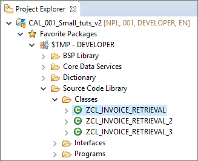
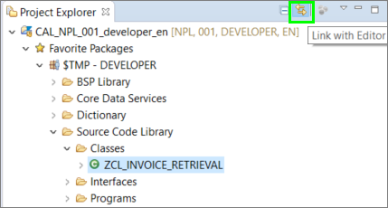
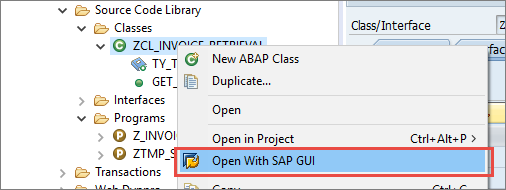
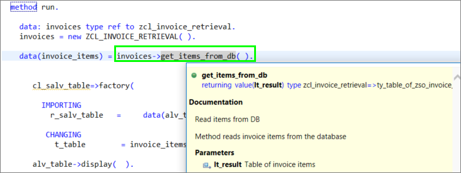

## Prerequisites  
 - You have a valid instance of an on-premise AS ABAP server, version 7.51 or higher (some ABAP Development Tools may not be available in earlier versions)
 - You have installed [ABAP Development Tools](https://tools.hana.ondemand.com/#abap), latest version

## Details
### You will learn  
- How to make your program more readable by learning how to maintain `ABAPDoc` comments.
- How to synchronize the documentation and to display it, both in the ABAP Development Tools (ADT) and in SAP GUI.

ABAPDoc comments are used to document your code. This makes it more readsdfsdfable. If other developers use one of your development objects, they can find out more about it by selecting the object name in the code and choosing **Element Info ( `F2` )**
All ABAPDoc comments begin with **`"!`**.

Always replace `XXX` or `001` with your initials or group number.

### Time to Complete
**10 Min**

---

[ACCORDION-BEGIN [Step 1: ](Open your ABAP class)]
First, open your ABAP class.



[DONE]
[ACCORDION-END]

[ACCORDION-BEGIN [Step 2: ](Add an ABAPDoc comment)]
Immediately before the method definition, add an ABAPDoc comment to the class:
**`"! Method reads invoice items from database`** .

**NOTE**: You must insert the ABAPDoc comment **immediately** before the declaration; otherwise you will get a warning from ADT.


ABAPDoc comments can be used to document APIs and are displayed in the Element Info. All ABAPDoc comments begin with `"!` .

[DONE]
[ACCORDION-END]


[ACCORDION-BEGIN [Step 3: ](Add parameters to ABAPDoc)]
You can also use ABAPDoc to document method parameters using **Quick Assist**. Place the cursor inside of the ABAPDoc comment. Then open the Quick Assist menu using `**Ctrl+1**` and double-click on **Add missing parameters to documentation**.


The ABAPDoc comment is extended by a `@parameter ... | `. You can now use this to document the method parameters: To do so, just enter the documentation after the pipe symbol (` | `).


[DONE]
[ACCORDION-END]

[ACCORDION-BEGIN [Step 4: ](Synchronize short texts)]
We have documented our method using ABAPDoc. However, we also want to see the same short texts in the description fields of the form-based Class Builder in SAP GUI.
To do this, we need to tag the required text in the ABAPDoc as "synchronized" to ensure that it is synchronized with the Class Builder.

1. Mark the short text for your method in ABAPDoc as "synchronized" by surrounding it with the tag **`<p class="shorttext synchronized">...</p>`**.

2. Do the same for the short text of your parameter `lt_result`:

  

[DONE]
[ACCORDION-END]

[ACCORDION-BEGIN [Step 5: ](Save and activate)]
Save ( **Ctrl+S** ) and activate ( **Ctrl+F3** ) the class.

[DONE]
[ACCORDION-END]

[ACCORDION-BEGIN [Step 6: ](Link with Editor)]
Finally you will check that the synchronized short texts are also shown in the Class Builder. First we have to open the class in SAP GUI.
To easily find the class in SAP GUI, first choose **Link with Editor**:



[DONE]
[ACCORDION-END]

[ACCORDION-BEGIN [Step 7: ](View the ABAPDoc comments in SAP GUI)]

1. In the Project Explorer, select the class **`ZCL_INVOICE_RETRIEVAL`** and choose Open with SAP GUI from the context menu:

    

2. The method description shows the text we entered in the ABAPDoc comment in the synchronized tag:

    

3. Now choose **Parameters**. You will see that the description of the parameter has also been synchronized:

    

4. Finally, close the class in SAP GUI and return to your ABAP program by choosing Close:

    

[DONE]
[ACCORDION-END]

[ACCORDION-BEGIN [Step 8: ](Display element info)]

1. Back in the ABAP Program, position the cursor on the method call `GET_ITEMS_FROM_DB` and display the Element Info of the method by choosing **Element Info (`F2`)**. In addition to the method signature it also shows the ABAPDoc you wrote before:

    

2. Close the Element Info by choosing **ESC**.

The code for your class should now look like this:

```ABAP

CLASS zcl_invoice_retrieval DEFINITION
  PUBLIC
  FINAL
  CREATE PUBLIC .

  PUBLIC SECTION.
    TYPES: ty_table_of_zso_invoice_item TYPE STANDARD TABLE OF zso_invoice_item WITH DEFAULT KEY.

"! <p class="shorttext synchronized">Read items from DB</p>
"! Method reads invoice items from the database
"! @parameter lt_result | <p class="shorttext synchronized">Table of invoice items</p>
"!
    METHODS get_items_from_db
              RETURNING
                VALUE(lt_result) type ty_table_of_zso_invoice_item.
  PROTECTED SECTION.
  PRIVATE SECTION.
ENDCLASS.

CLASS zcl_invoice_retrieval IMPLEMENTATION.

  METHOD get_items_from_db.

  SELECT
    snwd_bpa~company_name,
    snwd_so_inv_item~gross_amount,
    snwd_so_inv_item~currency_code,
    snwd_so_inv_head~payment_status

  FROM
   snwd_so_inv_item
   JOIN snwd_so_inv_head ON snwd_so_inv_item~parent_key = snwd_so_inv_head~node_key
   JOIN snwd_bpa ON snwd_so_inv_head~buyer_guid = snwd_bpa~node_key

   INTO TABLE @lt_result

  WHERE
   snwd_so_inv_item~currency_code = 'USD'

  ORDER BY
   snwd_bpa~company_name.

   LOOP AT lt_result ASSIGNING FIELD-SYMBOL(<entry>).
        CASE <entry>-payment_status.
            WHEN 'P'.
                <entry>-payment_status = abap_true.
            WHEN OTHERS.
                <entry>-payment_status = abap_false.
        ENDCASE.
    ENDLOOP.
  ENDMETHOD.
ENDCLASS.

```

[DONE]
[ACCORDION-END]

[ACCORDION-BEGIN [Step 9: ](Test yourself)]
Create an ABAPDoc comment for the parameter `PLANETYPE`. The explanatory text should read **`Type of plane`**.

Enter the comment in the box below and choose **Submit Answer**.

[VALIDATE_1]
[ACCORDION-END]

### More Information
- SAP Help Portal: [Editing ABAP Doc Comments](https://help.sap.com/viewer/c238d694b825421f940829321ffa326a/7.52.2/en-US/a7b235922f6944bbaf3b36949e500b12.html)
- SAP Keyword Documentation: [ABAPDoc](https://help.sap.com/doc/abapdocu_752_index_htm/7.52/en-US/index.htm?file=abendoccomment.htm)


---
